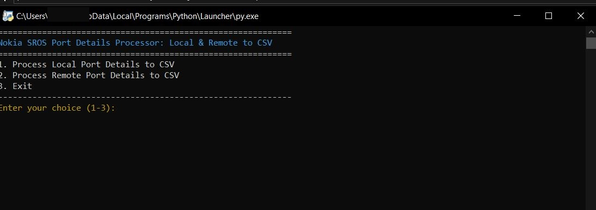
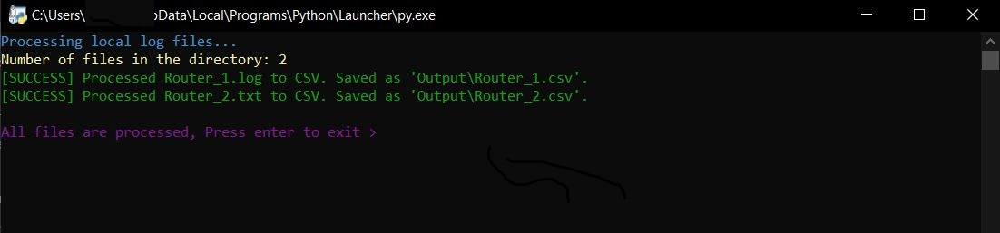
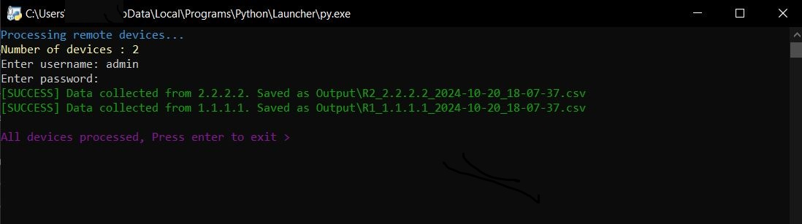
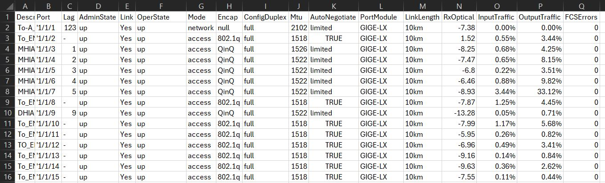

# Nokia SROS Port Details Processor: Local & Remote to CSV

## Project Description
This project provides a toolkit for processing and converting port details from Nokia SROS (Service Router Operating System) devices. It offers two main functionalities:

1. **Local Log Processing**: The tool can process port details from local log files that have been previously collected from Nokia SROS devices.

2. **Remote Device Connection**: It can directly connect to Nokia SROS devices, retrieve current port details, and process the data in real-time.

## Features

- Process local log files containing Nokia SROS `show port detail`
- Connect to remote Nokia SROS devices and fetch current port details
- Parse data using TextFSM templates for consistent output
- Generate standardized CSV files with processed port data, including:
  - Port State
  - Configured parameters
  - XFP/SFP Type
  - Traffic utilization (In and Out)
  - Optical signal level (Rx)
- Concurrent processing of multiple remote devices for efficiency `ThreadPoolExecutor`


## Requirements

- Python 3.6+
- See `requirements.txt` for required Python packages

## Installation

1. Clone this repository:
   ```
   git remote add origin https://gitlabe2.ext.net.nokia.com/irouass/nokia-sros-port-details-processor.git
   ```

2. Install required packages:
   ```
   pip install -r Lib/requirements.txt
   ```

## Usage

Run the main script:

```
python main.py
```

Follow the on-screen menu to choose between processing local files or remote devices.

### Processing Local Files

- Ensure your log files are in a directory
- Provide the input directory path, output directory path, and TextFSM template file path when prompted

### Processing Remote Devices

- Ensure you have a `devices.txt` file with a list of device IP addresses (one per line)
- Provide your username and password when prompted

## Files

- `main.py`: Main script with menu interface
- `port_details_local_to_csv.py`: Script for processing local log files
- `port_details_remote_to_csv.py`: Script for processing remote devices
- `Lib/nokia_sros_show_port_detail.template`: TextFSM template for parsing port details

## Sample Result

Here's a sample screenshot showing the CSV result of the script after successfully executing:









The resulting CSV includes key details such as Port State, Configured Parameters, SFP Type, Traffic Utilization, and Optical Signal Level, providing a comprehensive overview of port status and configuration.

## Contributing

Contributions are welcome! Please feel free to submit a Pull Request.

## License

This project is licensed under the MIT License.